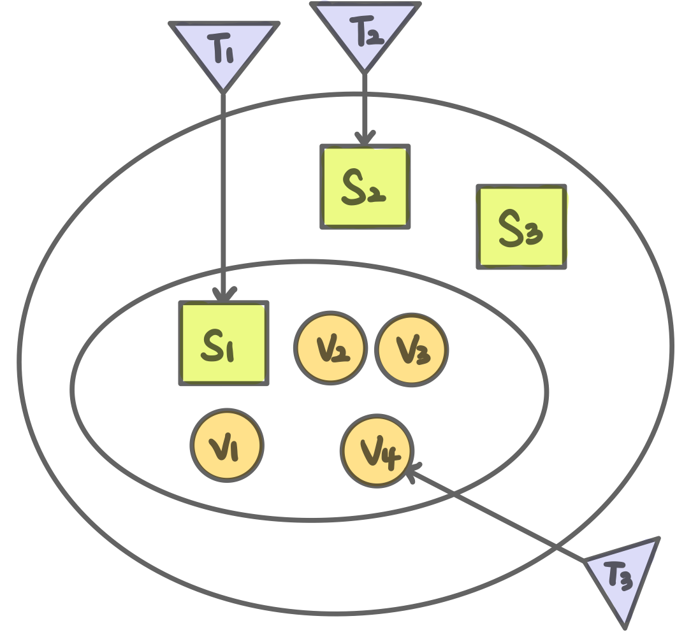

- 사이버보안개론 강의 내용을 토대로 정리한 포스트입니다.

---

# 해킹이란?

> Hacking is about **finding invention solutions** using the properties and laws of a system **in ways not intended by its designer**.

---

# 정보 보안(Information Security)이란?
> 자동화된 정보 시스템 내의 자원(하드웨어, 소프트웨어, 데이터, 네트워크)의 **기밀성, 무결성, 가용성** 등을 보존하기 위해 행해지는 활동

# 정보 보안 고려 요소

## 기밀성(Confidentiality)
- 허가되지 않은 사람/프로세스/시스템으로부터 **데이터나 자원을 숨기는 원칙**
- 위협 요소 : 도청, 사회 공학 등
- 보존하기 위한 활동 : 자산 분류, 식별, 인증, 권한 부여, 암호화, 모니터링, 교육 및 훈련 등

## 무결성(Integrity)
- **데이터 자원의 신회성**에 관한 것으로, 이를 위해서는 데이터나 자원이 **허가되지 않은 방식으로 변경되는 것으로부터 보호**되어야 한다는 원칙
- 위협 요소 : 트로이목마, 바이러스, 해킹 등
- 보존하기 위한 활동 : 직무 분리, 백신, 전자서명 등

## 가용성(Availability)
- 허락된 사용자는 데이터나 자원, 서비스를 **적절하고 신뢰성 있게 이용할 수 있어야** 한다는 원칙
- 위협 요소 : 서비스 거부 공격, 분산 서비스 거부 공격, 재해 등
- 보존하기 위한 활동 : 백업, 침입 탐지 시스템 운용 등

## 인증성(Authenticity)
- **사용자의 신원을 검증**하고, 전송된 메시지 출처룰 확인하는 것
- 위협 요소 : 메시지 변조, 중간자 공격 등
- 보존하기 위한 활동 : 메시지 인증, 전자서명 등

## 책임추적성(Accountability)
- 보안 침해가 발생했을 때 **책임 소재의 추적**이 가능해야 함
- 위협 요소 : 권한 남용, 권한 오용, 직무 유기 등
- 보존하기 위한 활동 : 시스템 로그 관리 및 포렌식 분석 등

## 부인방지(Non-repudiation)
- 사용자가 데이터 송신, 수신 또는 소유 등의 행위에 대한 책임을 부인하는 것을 방지하는 것
- ex) 메시지 수신자는 송신자가 실제로 해당 메시지를 송신한 것을 사후에 증명함으로써 전송 사실 부인을 방지할 수 있음

---

# 정보 보안 위협 요소

## 트로이목마(Trojan horse)
트로이목마는 고대 그리스 신화에 나오는 '신을 위한 선물로 위장한 거대한 목마'라는 의미와 유사한 성격을 지니고 있다.  

**마치 유용한 프로그램인 것처럼 위장**하여 사용자에게 접근해 설치를 유도한 뒤, **컴퓨터나 시스템 내부의 정보를 빼돌리거나 원격조종하는 프로그램**이다.  

트로이목마는 직접 전파가 아닌 주로 웹하드, P2P, 메일 등의 **간접적인 방식으로 전파**되며, 트로이목마다 숨어 있는 파일을 설치하는 순간 감염이 진행된다.

- **바이러스와 트로이목마의 차이점**
    - 트로이목마는 자기 복제 없이, 고의적인 부작용만 가지고 있는 프로그램이다.
    - 자기 자신을 복제하지 않는다는 점에서 컴퓨터 바이러스와 구별된다.
    - 예를 들어 어떤 프로그램을 실행했을 때, 하드디스크의 파일은 지우지만 다른 프로그램에 복제되지 않으면 이는 트로이목마라고 할 수 있다.

## 바이러스(Virus)
컴퓨터 바이러스는 **자기 복제 및 시스템 파괴**, 그리고 **다른 프로그램에 기생하여 방해**하는 악성 프로그램이다.  

감염 대상 코드의 실행 구조를 변경하거나, 내부 구조를 변경하여 대상의 수랭 전 후에 바이러스가 실행될 수 있도록 변경한다.

컴퓨터 바이러스는 감염 부위에 따라 4가지로 분류할 수 있다.

- 부트 바이러스(Boot Virus)
    - 컴퓨터가 처음 가동되면 하드디스크의 가장 처음 부분인 부트 섹터에 위치하는 프로그램이 가장 먼저 실행된다. 이곳에 자리잡는 컴퓨터 바이러스를 부트 바이러스라고 한다.
    - 대표적으로 브레인 바이러스(Brain Virus)와 원숭이 바이러스(Monkey Virus) 등이 있다.

 

- 파일 바이러스(File Virus)
    - 실행 가능한 프로그램에 감염되는 컴퓨터 바이러스를 의미한다.
    - 감염되는 대상은 주로 확장자가 COM, EXE인 실행 파일이다.
    - 가장 일반적인 컴퓨터 바이러스의 유형이다.
    - 대표적으로 예루살렘 바이러스(Jerusalem Virus), 선데이 바이러스(Sunday Virus) 등이 있다.

 

- 부트 파일 바이러스(Multipartite Virus)
    - 부트 섹터와 파일에 모두 감염되는 바이러스이다.
    - 대부분 크기가 크고, 피해 정도 또한 크다.
    - 대표적으로 침입자(Invader)와 에볼라(Ebola) 등이 있다.

 

- 매크로 바이러스(Macro Virus)
    - 새로운 파일 바이러스의 일종으로, 감염 대상이 실행 파일이 아니라 MS사의 엑셀과 워드에서 사용하는 문서 프로그램이다.
    - 응용 프로그램에서 매크로 사용을 통해 감염되는 형태로, 사용하는 문서를 읽을 때 감염된다.

### 서비스 거부 공격(DoS:Denial-of-Service)
서비스 거부 공격이란, 특정한 네트워크나 웹 리소스에 서버가 처리할 수 있는 능력 이상을 요구하여 합법적인 유저가 접근하지 못하도록 방해하는 것을 의미한다.  

주로 막대한 양의 트래픽을 통해 특정 대상에 과부하를 주거나, 악의적인 요청을 보내 오작동을 일으키게 하거나 정지시킨다.

- 서비스 거부 공격의 종류
    - 취약점 공격
        - 공격 대상이 특정 형태의 오류가 있는 네트워크 패킷의 처리 로직에 문재가 있을 때, 이를 이용해 공격 대상의 오작동을 유발
        - Boink, Bonk, TearDrop Attack
        - Land Attack

     

    - 자원 고갈 공격형
        - 네트워크 대역폭이나 시스템의 cpu, 세션 등의 자원을 소모시키는 형태의 공격
        - Ping of Death Attack
        - SYN Flooding Attack
        - Smurf Attack
        - Mail Bomb Attack

     

    - **분산 서비스 거부 공격(DDoS:Distributed Denial-of-Service)**
        - 공격자가 광범위한 네트워크를 이용허여 다수의 공격 지점에서 동시에 한 곳을 공격
        - **DoS와 DDoS의 차이**
            - 분산 서비스 공격은 단일 소스에서 발생하는 도스 공격보다 훨씬 더 성공적으로 대상을 파괴할 가능성이 높다.
            - 분산 서비스 공격은 공격이 여러 지점이서 시작되므로 공격의 근원지를 추적하는 것이 어렵기 때문에, 공격자들은 주로 이 방법을 선호한다.

---

# 정보 보안 주요 용어

## 취약점(Vulnerability) = 공격 벡터(Attack Vector)
- 시스템 보안 측면에서 악용될 수 있는 결함 또는 약점

## 위협(Threat)
- 공격자가 취약점을 악용하여 해를 끼칠 수 있는 **잠재적 위험(실행x)**
- 위협은 보안을 침해할 수 있는 상황, 능력, 행위 또는 이벤트가 존재할 때마다 발생
- 위협은 잠재적인 행위이며, 이 행위가 실제 일어나야 공격이 됨

## 위험(Risk)
- 특정 위협이 취약점을 이용하여 자산을 공격해서 **손실을 초래할 수 있는 잠재력**
- 위험 시나리오는 특정 위협이 어떨게 자산의 취약점을 이용해서 공격하는 지를 보여줌
- 위험은 **발생 가능성(확률)과 영향이라는 두 가지 요소의 결합**에 의해 특징지어짐

## 영향(Impact)
- **보안 사고가 자산에 미치는 결과**
- 특정 자산의 파괴, 가밀성/무결성/가용성의 상시르 조직의 이미지 추락 등 직,간접적인 손실

## 공격(Attack)
- 모든 취약점이 다 악용되어 실행되는 것은 아님
- **공격은 실행된 위협**으로, 성공한다면 보안 침해를 가져올 수 있음
    
## 공격의 분류
- 능동형, 수동형
    - **능동형(Active) 공격** : 시스템의 자원을 바꾸거나 영향을 미침
        - 악성파일 심기, 데이터 변겨으 네트워크 방해, 서비스 거부
        - ex) 스푸핑(spoofing) : 수집에 그치지 않고 수집된 패킷을 변경
    - **수동형(Passive) 공격** : 시스템 자원에 영향을 미치지 않고, 정보 획등 및 이용 도청, 트래픽 분석과 같은 수동형 공격은 네트워크에 실질적인 해를 가하지는 않음
        - 하지만, 도청 기법을 사용하여 능동형 공격에 필요한 정보를 획득
        - ex) 스니핑(Sniffing) : 특정 네트워크를 통과하는 데이터 패킷울 모니터링하고 수집하는 것
    - 이론적으로 볼 때, 수동형 공격을 발견하는 것은 매우 어려움

 

- 내부, 외부
    - **내부(Inside) 공격** : 보안 경계 내부에서 시작하여, 허용되지 않은 형태로 자원에 접근하는 것
        - 내부 직원에 의해 일어나는 경우가 많음
        - 패스워드 훔치기, 산업 스파이, 단순한 오용 등
        - **보안 경계(Security perimeter)** : 시스템이나 네트워크를 신뢰할 수 있는 부분과 그렇지 못한 부분으로 구분하는 개념
    - **외부(Outside) 공격** : 보안 경계 외부에서 허가되지 않은 사용자에 의해 시작

 

- 로컬, 원격
    - **로컬(Local) 공격** : 네트워크 상에 존재하는 컴퓨터 계정을 이용하여 공격
    - **원격(Remote) 공격** : 네트워크 외부에서 공격하는 것
    
 

- 치고 빠지기, 지속
    - **치고 바지기(Hit-and-Run) 공격** : 짧은 시간 동안 시스템을 혼란에 빠뜨리는 공격
    - **지속(Persistent) 공격** : 오랜 시간 동안 공격이 지속되는 것
    
 

- 중간자 공격 등
    - **중간자 공격** : 공격자 두 명의 유효한 사용자 사이에 끼어들어서 정보를 도청하거나 변조하는 형태의 공격
    - **전수조사(Bruteforce) 공격**
        - ex) 패스워드를 찾으려는 해커는 패스워드를 구성하는 모든 문자의 조합을 시도함으로써 해킹을 계속 시도

## 통제(Control) = 보안 대책(Safeguard)
- **보안 공격에 대응하는 수단**으로, 취약점을 없애거나 줄임으로써 **특정 공격을 방지**
    - 방지가 불가능하거나 실패한 경우, 공격을 탐지하고 복구하는 것을 목표로 함
- 보안 대책 S1은 취약점 V1에 대한 위협 T1으로부터 자산을 보호
- S3은 자산 내에 존재하는 임의의 취약점에 대한 모든 위협으로부터 자산을 보호

 

  

